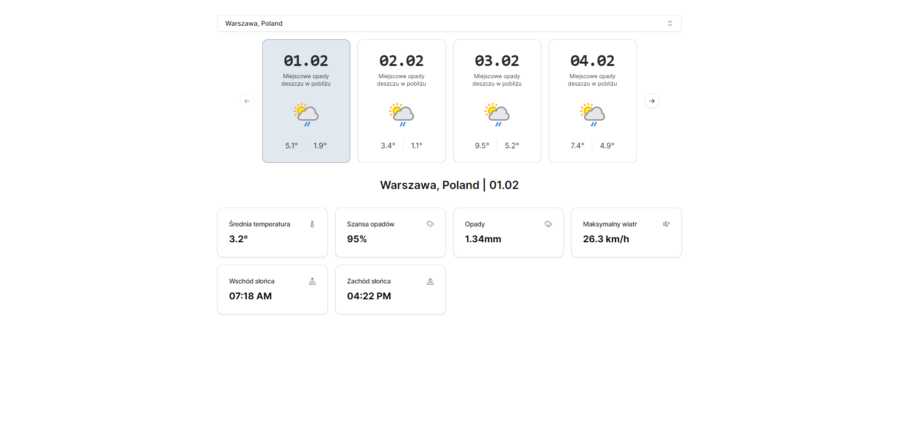

# Weather Forecast Application

This is a weather forecast application built with Next.js, utilizing Tailwind CSS for styling and shadcn/ui components for UI elements. It offers a 14-day weather forecast for a selected location.

DEMO: [https://weather.zkamil.dev/](https://weather.zkamil.dev/)



## Features

- **Select Location**: Users can search for and select a location to view its weather forecast.
- **14-Day Weather Forecast**: Displays a weather forecast for the next 14 days for the selected location.
- **Responsive Design**: Utilizes Tailwind CSS for a responsive layout that adapts to various screen sizes.
- **Interactive Components**: Features interactive components like popovers, carousels, and buttons using shadcn/ui library.

## Technology Stack

- **Next.js**: A React framework for building single-page JavaScript applications.
- **Tailwind CSS**: A utility-first CSS framework for creating custom designs.
- **shadcn/ui**: A collection of React components for building user interfaces.
- **React Query**: Manages asynchronous data fetching, caching, and updating.
- **Lucide React**: Provides a collection of React icons for enhancing UI elements.

## Getting Started

To get started with this application, follow these steps:

1. **Clone the Repository**

```bash
git clone https://github.com/kamilziemann/weather-app
```

2. **Install Dependencies**

Navigate to the project directory and install the necessary dependencies:

```bash
pnpm install
```

3. **Run the Application**

Start the development server:

```bash
pnpm dev
```

The application will be available at `http://localhost:3000`.

## Components Overview

- **Search**: Allows users to search for and select locations.
- **ForecastPreviewCard**: Displays a summary of the weather forecast for a day.
- **ForecastDetails**: Shows detailed weather information for a selected day.
- **AlertDestructive**: Used to display error messages.
- **UI Components**: Includes buttons, carousels, and popovers from shadcn/ui for navigation and interaction.

## API Integration

This application fetches weather forecast data from a [https://www.weatherapi.com/](https://www.weatherapi.com/) API using the `api` module defined in `@/lib/api`. It uses React Query for data fetching, caching, and state management.
